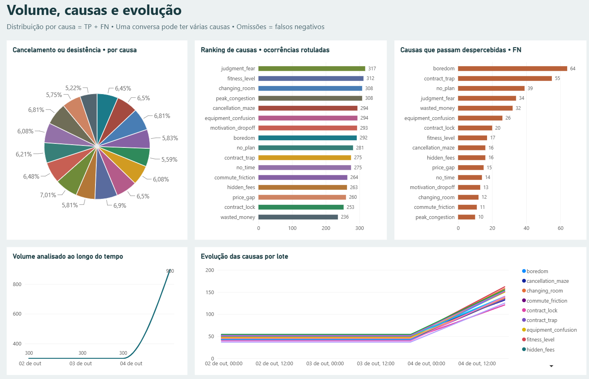

# gemma-microservices

A production-grade, bounded batch pipeline microservices architecture that turns conversation datasets into structured predictions, performs automated causal analysis with LLMs, indexes analytical history into BigQuery, and delivers aggregate notifications.

Go handles dataset preparation, pipeline orchestration, and backend microservices; Python handles local and cloud model inference.

## Architecture Overview

```
[ Conversation Data ]
         │
         ▼
[ Go Dataset Preparer ] ── (Synthetic batch generation & schema validation)
         │
         ▼
[ Worker A (Python) ]   ── (vLLM / Gemma inference & structured extraction)
         │
         ▼
[ Worker B (Go) ]       ── (ADK agent analysis, causal reasoning, validation)
         │
         ├──► [ BigQuery ]      (Analytical history & metric storage)
         ├──► [ Cloud Storage ] (Immutable batch results & audit trail)
         ├──► [ Notifier ]      (Pub/Sub triggered aggregate reporting)
         └──► [ Power BI ]      (Business intelligence dashboards)
```

### Component Inventory

| Component | Technology | Role |
| --- | --- | --- |
| **Dataset Preparer** | Go | CLI tooling for synthetic dataset generation, partitioning, and validation. |
| **Inference Worker (A)** | Python (vLLM / PyTorch) | Model inference worker supporting Gemma architectures with bounded batch execution. |
| **Analysis Worker (B)** | Go (Google GenAI SDK) | Multi-agent analytical pipeline, causal reasoning, BigQuery indexing, and reporting. |
| **Infrastructure** | Terraform | Modular Infrastructure as Code (`foundation` and `application` components). |
| **Observability & BI** | Cloud Logging / Power BI | Telemetry tracking, pipeline metrics, and executive reporting dashboards. |

## Prerequisites

Before setting up or deploying the pipeline, ensure you have the following installed:

- **Go**: Version 1.22 or later
- **Python**: Version 3.11 or 3.12 with `venv` support
- **Terraform**: Version 1.8 or later
- **Docker**: For building and testing container images
- **Google Cloud SDK**: (`gcloud`) Optional for cloud deployment, not required for local testing

## Quickstart

### 1. Clone and Local Setup

```sh
# Set up a local Python virtual environment
python3 -m venv .venv
source .venv/bin/activate
pip install -r worker-a/requirements.lock
pip install pytest

# Download Go dependencies
go mod download
go -C worker-b mod download
```

### 2. Run Local Verification

Execute the test suites and security scans locally without cloud credentials:

```sh
# Run all unit tests, linters, and verification checks
make ci

# Run Go pipeline integration tests
make test-pipeline

# Run Terraform format and test suites
make test-terraform
```

All integration fixtures use synthetic data generated in isolated temporary directories. No cloud billing or API keys are required for offline verification.

## Infrastructure Deployment

The infrastructure is organized into two independent Terraform components under `terraform/components/`:

1. **Foundation (`terraform/components/foundation`)**: Manages core networking, Cloud Storage buckets, Artifact Registry repositories, and baseline IAM roles.
2. **Application (`terraform/components/application`)**: Deploys Cloud Run Jobs, Cloud Run microservices, BigQuery datasets, Pub/Sub topics, and secret bindings.

### Configuration

Copy the example variable configurations and adjust for your Google Cloud project:

```sh
# Foundation configuration
cp terraform/components/foundation/terraform.tfvars.example \
   terraform/components/foundation/terraform.tfvars

# Application configuration
cp terraform/components/application/terraform.tfvars.example \
   terraform/components/application/terraform.tfvars
```

Edit each `.tfvars` file to specify your Google Cloud project ID, region, and notification settings, then deploy:

```sh
# Deploy foundation
cd terraform/components/foundation
terraform init
terraform apply

# Deploy application
cd ../application
terraform init
terraform apply
```

See [operations guide](docs/operations.md) for detailed deployment, monitoring, and teardown workflows.

## Power BI Dashboard

The system includes a pre-configured Power BI analytical report connected to BigQuery. The dashboard provides insight into conversation volumes, causal factors, model accuracy, and temporal trends.



For setup details, see [Power BI Documentation](docs/powerbi.md) and [Report Metadata](powerbi/README.md).

## Documentation

- [System Architecture](docs/architecture.md)
- [Data Boundaries & Governance](docs/data-boundaries.md)
- [Development Guide](docs/development.md)
- [Operations & Runbooks](docs/operations.md)
- [Pipeline Observability](docs/pipeline-observability.md)
- [Validation Evidence](docs/validation.md)
- [Production Readiness Checklist](docs/production-readiness.md)
- [Dataset Specifications](data/README.md)
- [Diagnostic Utilities](diagnostics/README.md)
- [Project Changelog](CHANGELOG.md)

## License

This project is licensed under the Apache License, Version 2.0. See the [LICENSE](LICENSE) file for details.
