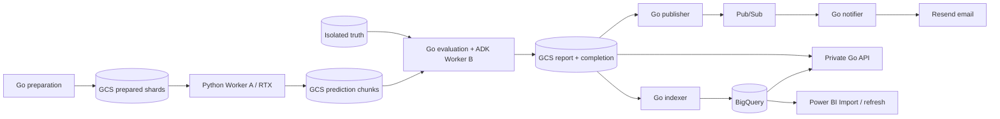

# Architecture

## Data flow

The local Go coordinator controls launches and journals their identities. It
checks source hashes, pinned images, deployment bounds and completion markers.
An optional fresh preparation stage pins raw inputs, launches the preparer once,
verifies manifest/shard/truth hashes and journals them before GPU launch. Fresh
mode rejects existing prepared/prediction outputs. Historical CPU-only plans
remain compatible.
GCS carries artifacts; requests/events carry references rather than datasets.
Worker A cannot access truth. The evaluator computes scores; the model explains
verified metrics. The notifier formats aggregate email without an LLM.

## Runtime definitions

Five Jobs implement preparation, Worker A, analysis, indexing and publication.
Two private services implement the API and notifier. GPU tasks are explicitly
launched and bounded; CPU Jobs have one task, one parallel task and no retry.
Private services have minimum zero, maximum one and concurrency one. No Cloud
Function, workflow engine or Firebase messaging service is deployed for this MVP.

The fresh profile processes three 300-record shards in parallel and consolidates
all 900 into one report and notification. The original single-shard contracts
remain readable. Images, model versions, prompts and schemas are pinned/versioned.

## Durable boundaries

| Boundary | Evidence |
| --- | --- |
| Preparation | Versioned manifest, dialogue-only shards and separate truth. |
| GPU task | Resumable Parquet chunks and a verified success marker. |
| Analysis | Create-only request claim, metrics, report and hashed completion; failure preserves artifacts. |
| Index | Deterministic indexing attempt and independent receipt/status. |
| Publication | Immutable intent, stable event/report identity and publish receipt. |
| Delivery | Validated event, durable sink/notification receipt and provider acknowledgment. |
| Coordinator | Local launch journal and verified remote execution identity. |

A partial/corrupt source cannot trigger a full-population model call. A failed
analysis cannot publish a completed report. Replaying completed work reuses its
durable evidence. Unknown outcomes stop for inspection.

## Terraform ownership and current state

Foundation owns shared storage, registry and GPU/preparation infrastructure.
Application owns CPU analysis/data/messaging resources and additive IAM. The full-profile
wrapper coordinates these two independent states without duplicating ownership.
Their roots are `terraform/components/foundation` and
`terraform/components/application`. The MVP migration preserves local states,
Terraform resource addresses and cloud identifiers.

Optional Power BI IAM belongs to Application and persists independently of compute
switches. A configured Google user/group receives analytics dataset Data Viewer
and a dedicated project custom role for connector discovery, query creation,
quota use. It grants no dataset/table mutation,
GCS access, worker invocation or model access. Existing or inherited grants are
additive and must be checked before claiming that an identity is read-only.
The operator confirmed the BigQuery connection and completed Power BI dashboard.
Reports, measures and support tables are maintained in Power BI with Import
mode. After each completed analysis is indexed, model refresh reads the updated
tables and updates the dashboard's volume, causes and batch trends. The model
retains its snapshot between refreshes; this repository configures no automatic
refresh schedule. See [data flow and setup](powerbi.md) and the
[dashboard preview](../powerbi/power-bi.png).

The approved MVP deployment published four immutable CPU images, restored the
preparation/GPU Job definitions and updated the three CPU Jobs and two private
services. Foundation manages 27 resources; Application manages 53, including
Power BI IAM. Three analysis reader conditions now reference the new acceptance
run. Models, source data, analytical history, queues, secret and worker network
are preserved. Both refreshed plans show no drift. Read-only coordinator
preflight passed, and the approved fresh coordinator workload completed through
provider-accepted email. See [validation](validation.md).

## Current acceptance

The 2026-10-05 fresh 900-record coordinator run passed preparation, three GPU
tasks, live ADK/Vertex analysis, indexing, private API checks, publication and
provider-accepted v2 email without manual recovery. Quality passed at 99%
accuracy and 90.2338% cause micro F1; completed-plan replay produced no additional
work. The operator confirmed inbox arrival on 2026-10-05; the fresh-run acceptance gate is complete. Historical failed attempts and the
previous confirmed CPU recovery remain recorded. See [validation](validation.md) and
[requirements](../PRD.md).

## Data visibility

The canonical report and private report API retain bounded conversation evidence.
BigQuery omits the direct evidence array but includes model narrative, which may
reference source text. Email carries aggregate metrics only. See
[data boundaries](data-boundaries.md) for the field inventory and publication
policy, including private Power BI binaries and pinned synthetic assets.
